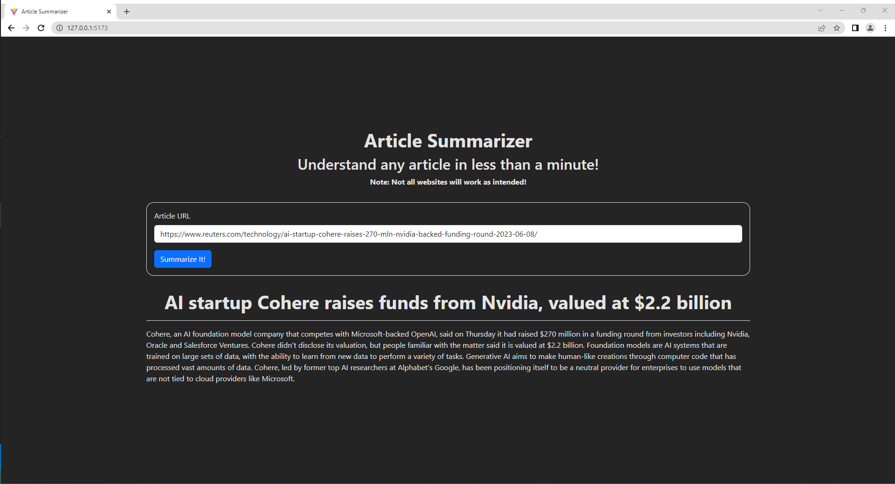

# Article Summarizer

Interested in an article but you're too short on time? No worries! The article summarizer can help you understand it in less than a minute (or just a few minutes if longer than that).

This project takes advantage of Extractus's [ article-extractor](https://github.com/extractus/article-extractor) and [Cohere](https://cohere.com/)'s large language models (LLMs) (primarily the "Summarize" feature) to give users summaries of articles they want to learn about.

Since this project is primarily for demonstration purposes, there is currently no production link yet.

## Preview Screenshot
